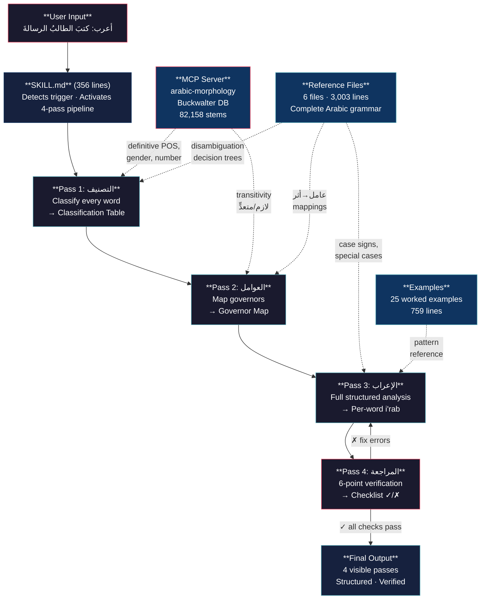
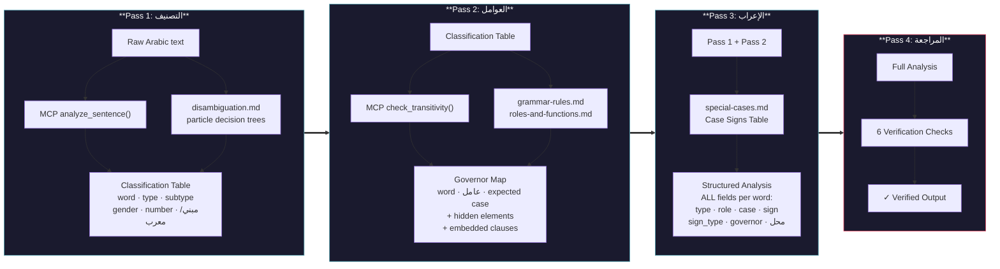
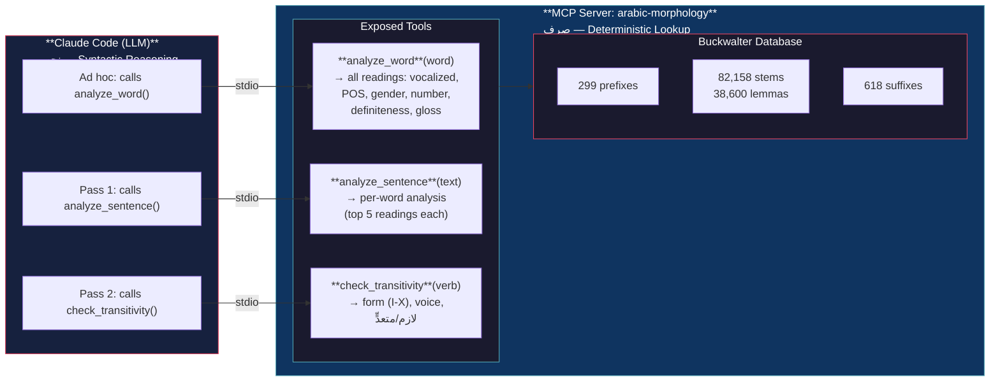
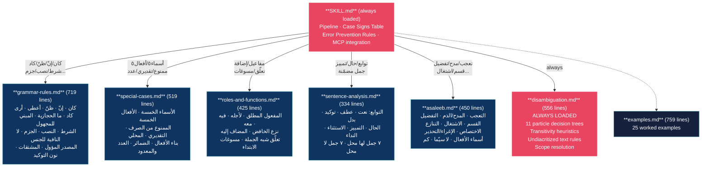
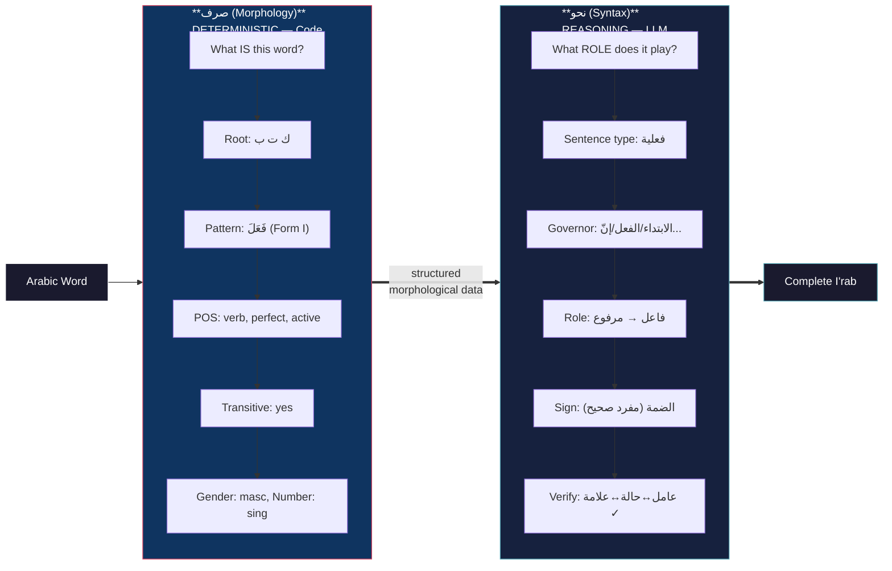

# I'rab Skill — Full Architecture

## 1. System Overview

## 2. The 4-Pass Pipeline

## 3. MCP Server — Deterministic Morphology

## 4. Reference Files — Loaded on Demand

## 5. The Core Split: صرف vs نحو

## 6. File Inventory

| File | Lines | Contents |
|------|------:|---------|
| `SKILL.md` | 356 | Main skill: 4-pass pipeline, case signs table, error prevention, MCP integration |
| `references/grammar-rules.md` | 719 | النواسخ, الحروف العاملة, المبني للمجهول, المشتقات, المصدر المؤول |
| `references/disambiguation.md` | 556 | 11 particle decision trees, transitivity, tashkeel disambiguation, scope |
| `references/special-cases.md` | 519 | العلامات الفرعية, بناء الأفعال, الضمائر, العدد والمعدود |
| `references/asaleeb.md` | 450 | 12 أساليب نحوية (تعجب, مدح, تفضيل, قسم, ...) |
| `references/roles-and-functions.md` | 425 | المفاعيل الخمسة, المضاف إليه, تعلّق شبه الجملة, مسوغات |
| `references/sentence-analysis.md` | 334 | التوابع, الحال, التمييز, 7+7 جمل لها/ليس لها محل |
| `examples/examples.md` | 759 | 25 fully-worked canonical examples |
| `mcp-server/server.py` | 336 | MCP server wrapping Buckwalter (82,158 stems) |
| **Total** | **4,454** | |
